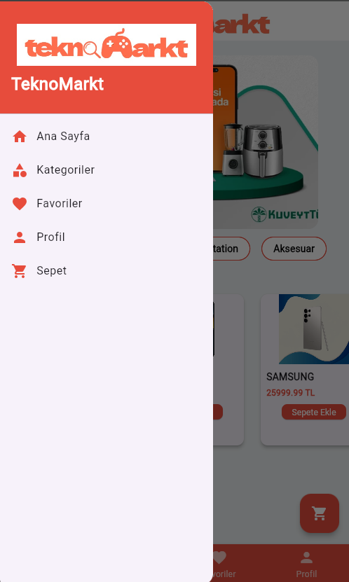
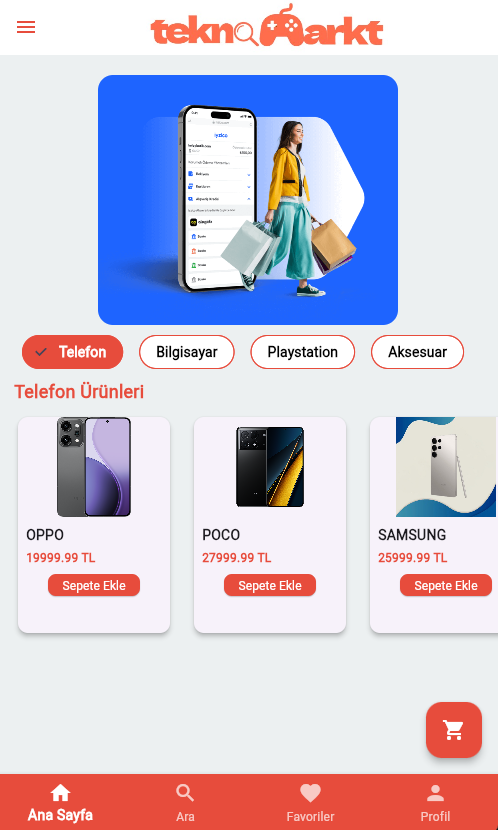

# 📱 Teknomarkt - Mobil E-Ticaret Uygulaması

Teknomarkt, kullanıcıların en son teknoloji ürünlerini listeleyebildiği, detaylarını inceleyebildiği ve sepet işlemlerini gerçekleştirebildiği bir Flutter mobil uygulama projesidir.

## 🚀 Özellikler
* **Ürün Listeleme:** Kategorilere ayrılmış teknoloji ürünleri.
* **Detay Sayfası:** Ürün özellikleri ve fiyat bilgisi.
* **Sepet Sistemi:** Ürün ekleme, çıkarma ve toplam tutar hesaplama.
* **Kullanıcı Dostu Arayüz:** Modern ve temiz UI tasarımı.

## 🛠 Kullanılan Teknolojiler
* **Framework:** [Flutter](https://flutter.dev)
* **Dil:** [Dart](https://dart.dev)

## 📸 Ekran Görüntüleri
 

## 📦 Kurulum
1. Bu depoyu klonlayın: `git clone https://github.com/bahrikarakok/Teknomarkt-mobile.git`
2. Paketleri yükleyin: `flutter pub get`
3. Uygulamayı çalıştırın: `flutter run`